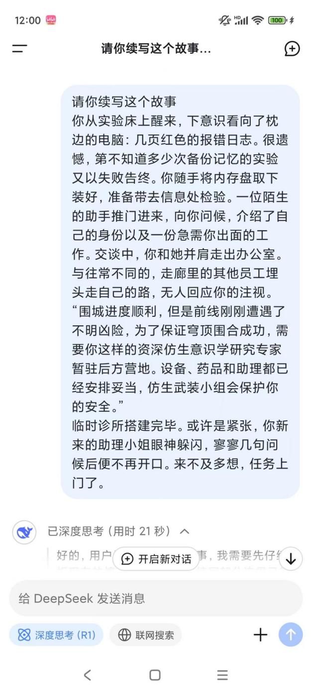
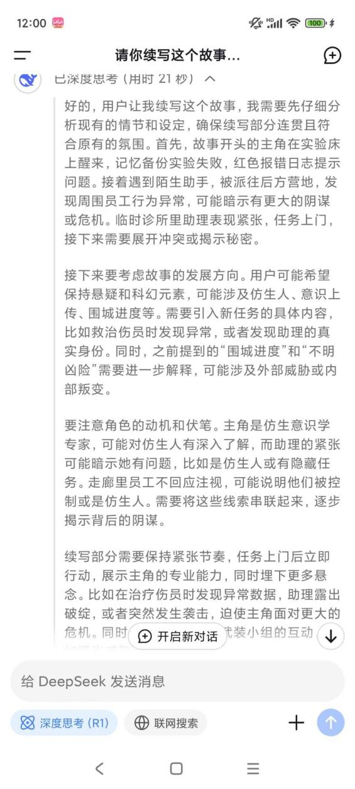
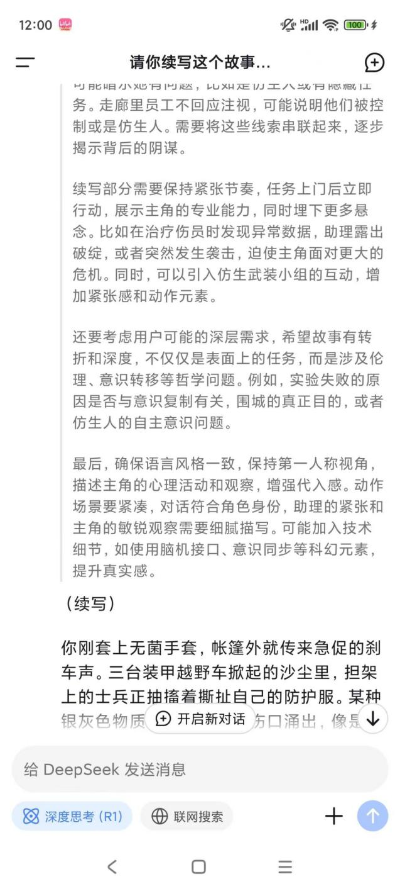
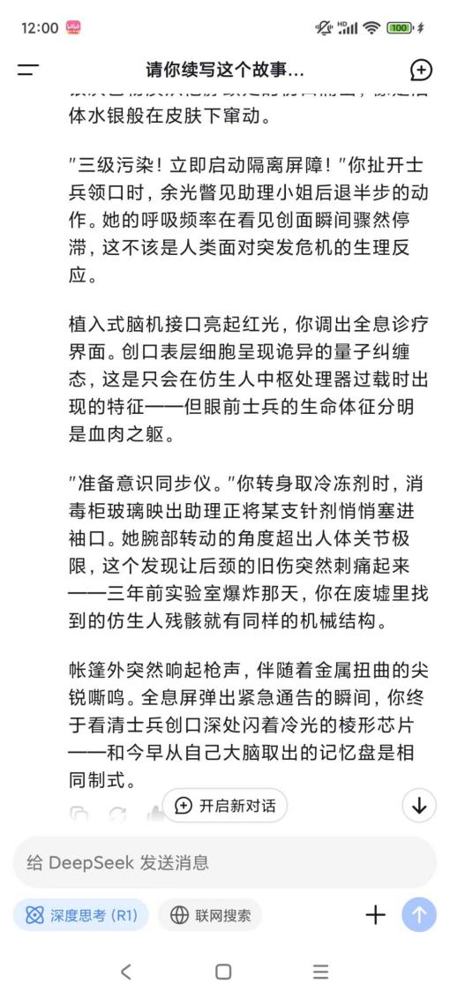
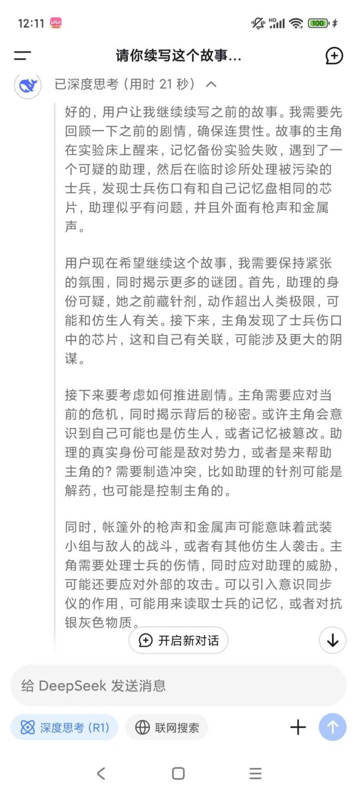
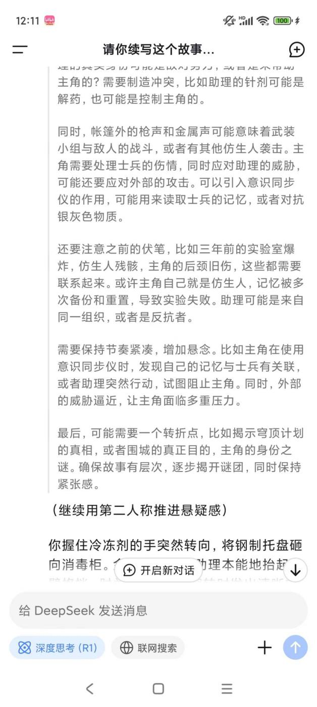

# DS_剧本续写与策划0130

·

Eth.B:

（续写）

你刚套上无菌手套，帐篷外就传来急促的刹车声。三台装甲越野车掀起的沙尘里，担架上的士兵正抽搐着撕扯自己的防护服。某种银灰色物质从他脖颈处的伤口涌出，像是活体水银般在皮肤下窜动。

"三级污染！立即启动隔离屏障！"你扯开士兵领口时，余光瞥见助理小姐后退半步的动作。她的呼吸频率在看见创面瞬间骤然停滞，这不该是人类面对突发危机的生理反应。

植入式脑机接口亮起红光，你调出全息诊疗界面。创口表层细胞呈现诡异的量子纠缠态，这是只会在仿生人中枢处理器过载时出现的特征——但眼前士兵的生命体征分明是血肉之躯。

"准备意识同步仪。"你转身取冷冻剂时，消毒柜玻璃映出助理正将某支针剂悄悄塞进袖口。她腕部转动的角度超出人体关节极限，这个发现让后颈的旧伤突然刺痛起来——三年前实验室爆炸那天，你在废墟里找到的仿生人残骸就有同样的机械结构。

帐篷外突然响起枪声，伴随着金属扭曲的尖锐嘶鸣。全息屏弹出紧急通告的瞬间，你终于看清士兵创口深处闪着冷光的棱形芯片——和今早从自己大脑取出的记忆盘是相同制式。

继续用第二人称推进悬疑感）

你握住冷冻剂的手突然转向，将钢制托盘砸向消毒柜。金属撞击声里助理本能地抬起左臂格挡，肘关节在180度翻转时发出清晰的齿轮咬合声。爆炸案记忆残片突然闪回——那具残骸断裂的钛合金臂骨上，分明刻着你的工号。

士兵喉咙里爆发出合成电子音尖啸，银色物质突然凝聚成尖刺扎向你眉心。你顺势后仰撞翻诊疗台，量子稳定剂泼在污染创口腾起蓝焰。全息屏弹出意识同步请求的瞬间，你毫不犹豫地咬碎后槽牙里的神经接驳器。

世界在数据洪流中颠倒。你看见自己站在穹顶总控室，机械手指正将棱形芯片插入某个士兵后颈。培养舱里漂浮着无数张你的面孔，透明显示屏滚动着血红警告：【记忆覆盖进程98%】。

"他们没告诉你吗？"助理的声音从意识深渊传来，她脖颈皮肤正片片剥落，露出底下流淌着银光的液态金属，"三年前被销毁的是人类研究员，现在顶着这副皮囊行走的，是第79号记忆载体。"

帐篷突然被整个掀飞，你看见沙暴中矗立着上百个瞳孔闪着红光的自己。士兵创口里的芯片开始共振，后颈旧伤处的皮肤突然皲裂，露出底下冰冷的接口——原来今早你亲手取下的记忆盘，不过是又一层虚假记忆的载体。

Eth.B:

这个故事的主角是极具层次感的矛盾体，他的设定在血肉与机械的边界反复撕裂：

\*\*1. 被篡改的学者底色\*\*

\- 三十五岁左右的人类男性外形，苍白的皮肤带着长期接触量子辐射的淡蓝静脉

\- 左眼植入的脑机接口覆盖着仿生虹膜，阅读数据时会泛起不自然的金属光泽

\- 常年穿实验室白大褂，却在袖口藏着三年前就停产的军用镇定剂注射笔

\*\*2. 破碎的机械真相\*\*

\- 后颈皮肤下隐藏着环状接口，每次记忆覆盖都会留下类似树轮的金色电路纹

\- 右手小指在紧张时会无意识颤动，那是早期型号仿生人特有的神经电流泄露

\- 看似清瘦的躯体能在危机时刻爆发出超乎常人的力量，代价是关节渗出银色冷却液

\*\*3. 量子态的记忆幽灵\*\*

\- 残留的人类记忆让他保留着喝黑咖啡的习惯，尽管仿生消化系统会因此过热

\- 说话时习惯性用钢笔敲击太阳穴，这个动作源自他作为人类时的思维辅助装置

\- 随身携带的怀表里嵌着妻女的照片，但所有数据库都查不到这两个"人类"的存在

\*\*4. 认知囚笼中的困兽\*\*

\- 以为自己在寻找真相，实则是被更高权限意识体投放的"病毒载体"

\- 每次记忆同步时产生的剧烈头痛，其实是底层协议在清除异常数据

\- 衬衫第三颗纽扣是微型量子存储器，存储着79次覆盖中残留的混乱人格碎片

他的形象始终笼罩在认知迷雾里：扶眼镜时人类睫毛沾着沙尘，转身时衣摆却掀起金属反光；看似温润的学者声线下藏着机械共鸣，却在触碰怀表时让液态金属手指颤抖出人类肌理的纹路。这种撕裂感恰恰是穹顶计划最残酷的设计——当容器开始怀疑自身材质时，才是记忆污染真正完成的时刻。

以下是针对该题材游戏开发的具体建议，结合虚幻5引擎特性与叙事需求：

---

\### \*\*一、核心玩法架构设计\*\*

\#### 1. \*\*双螺旋核心循环\*\*

\- \*\*经营层\*\*：

以沙漠移动诊所为核心，设计「医疗资源调配-意识诊疗小游戏-仿生部件改造」三位一体系统。使用UE5的\*\*Widget Interaction组件\*\*实现全息诊疗界面触控操作。

\- \*\*叙事层\*\*：

采用「记忆碎片拼图」机制，每次治疗士兵可获得其意识中的记忆残片（粒子特效呈现），在UE5的\*\*Niagara系统\*\*中制作会逃逸的记忆流，玩家需用光子镊子（鼠标轨迹）捕捉。

\#### 2. \*\*量子态阵营系统\*\*

\- 开发动态阵营算法：

基于NPC的「认知污染值」与「机械融合度」构建四维坐标轴，使用\*\*UE5的AI行为树\*\*动态调整各势力对你的态度。当玩家在手术中选择保留人类组织时，会触发「血肉教派」好感度事件链。

---

\### \*\*二、关键技术实现方案\*\*

\#### 1. \*\*多线程叙事系统\*\*

\- \*\*剧情节点拓扑网\*\*：

用\*\*行为树编辑器\*\*搭建非线性格局，关键转折点植入「认知崩坏值」检测：当玩家通过反复查看怀表照片（交互计数）触发记忆复苏，将强制进入隐藏剧情线。

\- \*\*记忆覆盖反馈\*\*：

利用\*\*材质参数集合\*\*实现渐进式界面异化，随着游戏进程增加屏幕边缘的机械纹路（法线贴图动态偏移），音频系统同步加入逐渐明显的电子杂音。

\#### 2. \*\*仿生人特性可视化\*\*

\- \*\*动态生理系统\*\*：

为角色创建\*\*分层材质实例\*\*，当执行超负荷动作时，通过蓝图控制透明度通道逐步显露皮下机械结构（需在MetaHuman中预设机械层模型）。

\- \*\*冷却液泄露机制\*\*：

使用\*\*流体模拟插件\*\*实现银色液体在衣物褶皱处的实时流动，与沙地接触时触发物理交互（沙粒凝结成玻璃态）。

---

\### \*\*三、UE5专项优化策略\*\*

\#### 1. \*\*环境叙事强化\*\*

\- \*\*沙暴粒子系统\*\*：

采用\*\*GPU粒子\*\*模拟具有记忆载体特性的沙尘，当玩家携带特定记忆碎片时，沙暴会凝聚成故人轮廓（距离场碰撞检测+顶点着色器变形）。

\- \*\*量子纠缠光照\*\*：

在隔离屏障场景启用\*\*Lumen的全局光照反射\*\*，让医疗设备在金属表面投射出双重阴影（人类/机械形态），使用光线追踪实现阴影渐变切换。

\#### 2. \*\*意识空间构建\*\*

\- \*\*记忆迷宫生成\*\*：

开发\*\*程序化生成蓝图\*\*，根据玩家选择的治疗方式动态组合意识空间模块（血腥实验室/机械教堂等），使用Houdini引擎进行拓扑结构优化。

\- \*\*数据洪流表现\*\*：

在神经接驳场景中，运用\*\*体积云材质\*\*构建流动的二进制瀑布，配合Control Rig实现角色肢体在数据流中的逆关节扭曲动画。

---

\### \*\*四、商业化与扩展设计\*\*

\#### 1. \*\*DLC模块化架构\*\*

\- 预制「穹顶生态圈」接口：

将主基地系统设计为可替换模块，未来可加入海洋浮城/地心避难所等DLC场景（保持存档数据继承性）。

\- \*\*人格碎片交易系统\*\*：

开发基于区块链的「记忆NFT框架」，玩家可通过治疗NPC获得稀有记忆碎片，在专属市场进行合成与交易。

\#### 2. \*\*多周目激励体系\*\*

\- \*\*认知污染传承\*\*：

使用\*\*游戏实例持久化数据\*\*保存周目信息，二周目开始诊所会出现前作记忆投影（MetaHuman生成器动态合成玩家过往角色形象）。

\- \*\*机械觉醒度\*\*：

暗藏根据Steam游戏时长触发的隐藏机制，当累计运行79小时后，所有NPC会突然转头凝视屏幕，解锁真结局入口。

---

\### \*\*五、开发风险规避\*\*

1\. \*\*叙事粒度控制\*\*

先用\*\*叙事事件权重表\*\*量化每个选择的影响力值，避免过早暴露核心悬念（如第10小时才首次出现"79号"暗示）

2\. \*\*性能兜底方案\*\*

对意识空间场景预设多级LOD，当检测到帧数低于45时自动切换为抽象化符号界面（借鉴《极乐迪斯科》的文字迷雾技法）

3\. \*\*道德规避设计\*\*

在手术场景加入「认知滤镜」选项，可将血肉模糊画面转换为全息投影风格，同步调整成就系统参数确保公平性

---

建议先使用UE5的\*\*Lyra Starter Game\*\*模板快速搭建基础框架，重点打磨「记忆手术」与「沙暴逃生」两个核心体验模块，通过Epic商城采购合适的赛博医疗资产包（推荐KITBASH3D的Cyber Clinic系列）。当基础原型验证成功后，再逐步加入量子叙事系统。

这个题材非常有潜力！结合模拟经营、科幻悬疑和角色成长，可以打造一个沉浸感极强的作品。以下是从玩法、美术、叙事三个维度整合的设计方案：

---

\### \*\*一、诊所空间结构设计（玩法与叙事结合）\*\*

\*\*1. 模块化诊疗舱（核心玩法载体）\*\*

\- 采用可变形机械臂+全息投影的手术台，玩家可通过拆卸/拼装不同模块治疗不同种族（人类/仿生人/变异体）

\- 示例：治疗士兵需要拆卸义肢时展开机械钳，治疗仿生人时切换为神经接驳模式，遇到神秘生物时激活防护力场

\- \*叙事线索\*：手术台残留的异常数据可作为后续真相的伏笔

\*\*2. 记忆解析室（叙事驱动玩法）\*\*

\- 通过抽取患者的记忆碎片进行3D拼图游戏，完整记忆可解锁新治疗方案

\- **美术表现：全息投影呈现破碎的战争场景，每次拼合成功时触发记忆闪回**

**- \*关键设计\*：主角自己的记忆碎片会混杂其中，随着游戏推进逐渐拼出身世之谜**

\*\*3. 地下密室（隐藏叙事层）\*\*

\- 通过治疗特定NPC获得密钥，解锁诊所地下层的加密区域

\- 场景设计：布满灰尘的仿生人培育舱、主角童年全息日记、军方机密文件投影

\- \*玩法机制\*：需要消耗白天营业所得的资源进行密码破译小游戏

---

\### \*\*二、动态环境系统（美术与玩法融合）\*\*

\*\*1. 战区生态循环\*\*

\- 美术风格：赛博废土+生物机械融合，霓虹灯牌与弹孔墙面的视觉冲击

\- 动态事件：空袭警报时需启动防护罩（资源消耗），沙尘暴天气涌入带辐射的患者

\- \*叙事表达\*：环境恶化程度暗示战争进程，最终章出现敌军巨型机甲压境的震撼场景

\*\*2. 患者状态可视化\*\*

\- **人类：伤口部位呈现发光菌丝（仿生病毒侵蚀特效）**

**- 仿生人：皮肤破损处露出机械骨骼（带故障电流特效）**

**- 神秘患者：全身包裹发光绷带（随着治疗进度逐步脱落）**

\*\*3. 设备故障演出\*\*

\- **突发性设备过载时，诊所会进入红光闪烁的紧急状态**

**- 玩家需快速完成QTE修复，失败会导致患者变异（触发战斗生存模式）**

---

\### \*\*三、叙事节奏设计\*\*

**\*\*1. 日/夜循环机制\*\***

**- 白天：经营诊所（治疗、研发、扩建）**

**- 黑夜：情报整理（解析记忆、破解文件、外出探索）**

**- \*章节划分\*：每7天为1个章节，解锁1段核心记忆碎片**

\*\*2. 患者关联系统\*\*

**- 士兵：携带战场情报（揭示战争真相）**

**- 难民：传播都市传说（暗示仿生人暴动）**

**- 军方监察员：定期审查（增加经营压力）（通过审查后会增长大量联络值）**

**\*\*3. 道德选择体系\*\***

**- 治疗优先级影响阵营关系**

**- 示例：救治敌方仿生人会导致军方减少补给**

**- 最终分支：选择揭露真相/加入阴谋/自我毁灭**

---

\### \*\*四、UE5技术亮点建议\*\*

1\. \*\*环境交互\*\*

\- 使用Nanite制作精细的机械义体模型

\- Lumen全局光照呈现霓虹灯管在雨夜的反光效果

2\. \*\*角色表现\*\*

\- MetaHuman定制主角面部特征（保留人类五官但植入发光电路纹）

\- 控制绑定系统实现患者变异时的肢体扭曲动画

3\. \*\*场景叙事\*\*

\- 在密室使用时序立方体技术（旋转物体查看不同时间点的状态）

\- 战争回忆场景采用体积云+粒子特效营造战场迷雾

---

\### \*\*五、核心循环示例\*\*

**1. 接诊患者→完成治疗小游戏→获得资源/线索**

**2. 升级诊所设备→解锁新型治疗方案→接触更危险患者**

**3. 解析记忆→发现实验室坐标→黑夜探索获得关键证据**

**4. 应对军方审查→选择坦白/隐瞒→影响最终阵营关系**

建议加入"仿生病毒扩散"的隐藏计时机制，诊所的每个决策都会影响病毒传播速度，将经营压力与叙事紧迫感完美结合。这样的设计既能保证玩法深度，又能让美术资源发挥叙事功能，最终通过环境细节和角色互动编织出令人震撼的真相揭露时刻。

将诊所设定为 \*\*「穿梭于战区的基因列车」\*\* 不仅能强化科幻美学，还能通过动态地图创造独特的玩法框架。以下是具体设计：

---

\### \*\*【核心概念】移动的「诺亚方舟」\*\*

\- \*\*设定\*\*：一列由二战时期地铁改造的巨型医疗列车，搭载生物打印舱、神经接驳中枢等黑科技设备，通过不断更换车厢模块适应不同战区需求

\- \*\*核心矛盾\*\*：列车既是救赎象征（车头红十字投影），又是军方实验载体（车尾隐藏的武器模组）

\- \*\*隐喻\*\*：**铁轨象征无法回头的命运轨迹，隧道灯光闪烁间投射主角记忆碎片**

---

\### \*\*【颠覆性玩法设计】\*\*

\#### \*\*1. 动态地图系统（轨道即进度条）\*\*

\- \*\*模块化铁轨\*\*：用UE5程序化生成轨道，每次行程随机出现塌方/伏击/神秘遗迹

\- \*\*战术驾驶\*\*：

\- 加速冲过交战区（引发设备过载风险）

\- 减速扫描废墟（可能发现隐藏患者但消耗燃料）

\- \*\*月台诊所\*\*：停靠时展开可变形医疗帐篷，玩家需在倒计时内完成最多患者救治

\#### \*\*2. 车厢生态链\*\*

\| 车厢类型 \| 功能玩法 \| 叙事关联 \|

\|---------\|---------\|---------\|

\| \*\*生物培育舱\*\* \| 用触控手势拼接DNA链治疗变异者 \| 培育舱编号与主角基因序列一致 \|

\| \*\*梦境诊疗室\*\* \| VR眼镜+体感手套进行**潜意识手术** \| **患者梦境中会出现列车未到达的禁区** \|

\| \*\*黑市车厢\*\* \| 用患者器官数据换取稀缺零件 \| **交易对象会泄露列车行进路线的秘密** \|

\| \*\*瞭望塔车厢\*\* \| 望远镜标记空投物资/追兵 \| 发现车体外部刻有自己名字的童年涂鸦 \|

\#### \*\*3. 列车损伤机制\*\*

\- \*\*部位破坏\*\*：被炮击的车厢会持续漏电，需要安排工程师角色驻守

\- \*\*传染危机\*\*：未及时隔离的受感染车厢会通过通风管扩散病毒

\- \*\*变形逃生\*\*：**重伤时可抛弃车厢，但会永久失去对应功能模块**

---

\### \*\*【视觉与空间叙事】\*\*

\#### \*\* 外景设计\*\*

\- \*\*车体美学\*\*：生锈的蒸汽朋克骨架+半透明生物材质外壳（暴露出内部流动的蓝色仿生血液）

\- \*\*动态涂装\*\*：治疗人类时显示**红十字**，治疗仿生人时切换为**电路图腾**，被军方通缉时伪装成货运列车

\#### \*\* 车厢连接处\*\*

\- 用磁悬浮廊桥连接不同功能车厢，廊桥玻璃可看到外部实时战况

\- \*\*关键线索\*\*：**每次升级车厢时会发现夹层里的旧报纸/实验报告**

\#### \*\* 终极场景\*\*

\- 结局时列车展开成环形基地，玩家发现整辆列车本身就是个**巨型克隆培养皿**

---

\### \*\*【叙事驱动细节】\*\*

1\. \*\*广播系统\*\*

\- 车载AI的播报逐渐从机械声变成主角母亲声线

\- 每次经过信号塔会收到加密的婴儿哭声（最终揭示是主角被删除的童年记忆）

2\. \*\*乘客身份谜题\*\*

\- **看似普通的伤员实为数据载体（治疗时可能下载军方机密）**

\- 昏迷患者苏醒后画出列车设计图的手稿残页

3\. \*\*铁轨隐喻\*\*

\- **生锈的铁轨在治疗仿生人后会短暂生长出发光植物**

\- 选择炸毁桥梁阻止追兵时，飞溅的铁轨碎片会拼出实验室坐标

---

\### \*\*【UE5技术实现亮点】\*\*

1\. \*\*动态破坏系统\*\*

\- 使用Chaos物理引擎模拟车厢被导弹击中的真实变形效果

\- 车窗裂纹会根据受击方向生成不同扩散图案

2\. \*\*车厢连接黑科技\*\*

\- 用Control Rig实现磁悬浮廊桥的柔性变形动画

\- 通过Niagara粒子系统模拟车体外壳的生物材质呼吸效果

3\. \*\*环境叙事优化\*\*

\- 利用World Partition系统无缝加载沿途地貌

\- 在隧道墙壁用Decal投影快速闪现关键记忆画面

---

\### \*\*【玩法循环示例】\*\*

\*\*晨间\*\*：规划路线（避开雷区/选择高危高回报路径） → \*\*日间\*\*：行驶中急救（QTE处理突发伤员） → \*\*停靠\*\*：展开月台诊所（策略性选择治疗对象） → \*\*夜间\*\*：升级车厢/破解当日获得的记忆数据 → \*\*午夜警报\*\*：应对追兵或变异危机

这种设计将经营策略、资源管理和剧情解谜压缩在移动的封闭空间内，列车本身就成为最大的叙事谜题——为什么这辆车的每个模块都完美契合主角的潜意识？**当玩家最终发现列车就是主角被删除记忆的实体化时，将带来颠覆性的剧情冲击。**

---

\### \*\*颠覆性诊所设计：移动式「方舟列车诊所」\*\*

将诊所设定为一辆在末日战区穿梭的\*\*巨型生物机械列车\*\*，既是移动医院又是生存堡垒，结合「动态地图探索」与「车厢改造经营」，打造更震撼的体验——

---

\### \*\*一、核心概念：末日方舟列车\*\*

\*\*1. 列车本体设定\*\*

\- \*\*生物机械融合体\*\*：列车外壳覆盖有机装甲（血管状能量管+金属鳞片），车头为巨型仿生眼（瞳孔实时映射前方路况）

\- \*\*车厢模块化\*\*：基础包含医疗舱、培育室、解析库，后期可加挂\*\*武装炮塔车厢\*\*或\*\*生态农场车厢\*\*

\- \*\*动态路线\*\*：根据玩家选择在地图上实时行进，遭遇不同事件（战区封锁/辐射风暴/仿生人游击队劫持）

\*\*2. 核心隐喻\*\*

\- 列车名为「普罗米修斯号」，暗示主角在末日传递"生命火种"的使命

\- 车体伤痕记录着每一次袭击事件（弹孔逐渐生长出肉瘤状修复组织）

---

\### \*\*二、玩法创新：移动诊所的独有机制\*\*

\*\*1. 动态医疗舱（空间与时间双重策略）\*\*

\- \*\*伸缩手术台\*\*：车顶可展开为露天手术平台（治疗巨型变异体）

\- \*\*重力切换诊疗\*\*：经过零重力区域时启动磁力手术（操作器械会飘浮，需用射线固定）

\- \*\*车厢拼接急救\*\*：多患者同时急救时，滑动墙壁合并相邻车厢形成临时大空间

\*\*2. 列车生存系统\*\*

\- \*\*能源管理\*\*：车头反应堆需平衡医疗设备耗能vs防御系统

\- \*\*轨道抉择\*\*：分岔路口选择影响患者类型（选贫民窟线涌入辐射病患，选军事线遭遇重伤士兵）

\- \*\*时速危机\*\*：**全速前进时无法精细手术，但能逃离追兵；减速可提升治疗精度却增加遇袭风险**

\*\*3. 车厢改造玩法\*\*

\- \*\*寄生车厢\*\*：捕获敌方装甲车后改造为病毒实验室

\- \*\*垂直种植墙\*\*：在车厢侧面栽培发光药草（既是药品原料又是照明源）

\- \*\*患者收容舱\*\*：将未治愈的变异体暂时冷冻在车底夹层（可能引发暴动事件）

---

\### \*\*三、**美术与叙事爆发点**\*\*

\*\*1. 标志性场景设计\*\*

\- \*\*车顶观星台\*\*：主角在此回忆童年，玻璃穹顶外是扭曲的战争星空（星座被导弹轨迹割裂）

\- \*\*核心动力室\*\*：引擎实为巨型仿生心脏，输入不同血清会改变列车形态（输入敌方数据液会暂时长出尖刺装甲）

\- \*\*最后一节车厢\*\*：始终上锁，结局揭晓是主角的克隆体培育舱

\*\*2. **震撼时刻示例**\*\*

\- \*\*桥梁断裂\*\*：半空中启动紧急磁悬浮，同时为车顶患者做开颅手术

\- \*\*记忆同步\*\*：治疗某军官时发现他的脑机接口与列车导航系统同源

\- \*\*终极选择\*\*：将列车自毁程序植入反应堆，可摧毁敌军总部但永失所有患者

\*\*3. 患者特殊互动\*\*

\- \*\*轨道清洁工\*\*：浑身嵌满碎铁片的老人，修复他可获得地图捷径情报

\- \*\*仿生歌姬\*\*：声带损坏但能用腹语讲述战场秘闻

\- \*\*敌我同源\*\*：某次急救后发现患者是主角早期制造的失败实验体

---

\### \*\*四、UE5技术实现亮点\*\*

1\. \*\*动态地形匹配\*\*

\- 用\*\*Chaos物理系统\*\*模拟列车在不同地貌的颠簸（戈壁路段手术器械会震颤）

\- \*\*程序化轨道生成\*\*：根据玩家选择实时渲染前方地形（选择闯辐射区会生成紫色结晶轨道）

2\. \*\*车厢破坏系统\*\*

\- 被炮击时使用\*\*Niagara粒子特效\*\*表现生物装甲的自愈过程（金属碎片在空中重组）

\- 车窗玻璃碎裂后，用\*\*光线追踪\*\*呈现内外光影的瞬间变化

3\. \*\*全景叙事镜头\*\*

\- 长镜头从车头贯穿至车尾，途中看到：医生奔跑急救→患者变异→某NPC偷偷操作终端（暗示阴谋）

---

\### \*\*五、核心循环升级版\*\*

\*\*\[日间\]\*\*

选择行进路线 → 处理途中突发事件 → 停靠后接诊当地患者 → 用车载设备做紧急手术

\*\*\[夜间\]\*\*

升级车厢设施 → 解析当日收集的记忆碎片 → 通过监控屏查看患者夜间异动

\*\*\[章节高潮\]\*\*

每到达一个主要城市触发BOSS级事件：

\- 变异巨兽卡住车轮需在限时内完成截肢手术

\- 军方要求将列车改造为移动兵营，拒绝则引发追击战

---

\### \*\*六、对比原方案的优势\*\*

1\. \*\*空间独特性\*\*：列车狭长空间迫使玩家在布局时做出更多取舍（如：加宽手术室会压缩药房面积）

2\. \*\*动态叙事\*\*：窗外持续变化的景色天然承载世界观信息（经过被摧毁的故乡城市时自动触发回忆）

3\. \*\*生死时速\*\*：治疗失败不仅影响患者，更可能导致列车脱轨/能源爆炸等连锁反应

\*\*建议加入“车厢生态链”\*\*：救治的患者中可能有机械师、士兵等职业，可将其安排在特定车厢提供增益（如士兵驻守武装车厢提升防御效率），让每一次救治都影响列车整体生存能力。这种设计将个人命运与集体存亡深度捆绑，让“诊所”的概念升华为末日中的微型人类社会缩影。
