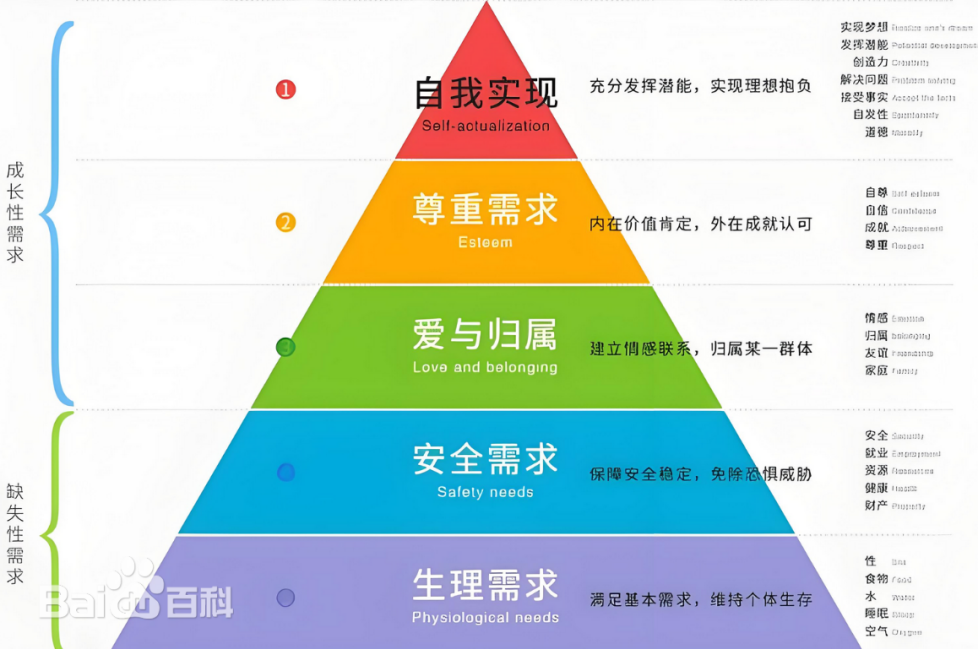

# 游戏策划案

**一、项目概述**

**\
定位**

模拟经营玩法，战争医疗题材，偏卡通画风，视觉小说

关键词：剧情向，生存，策略，建造，道德困境，小体量独游

**\
目标用户**

14~24岁，视觉小说、RPG游戏、经营游戏、二次元风格、独立游戏受众，偏男性，买断制用户

**参考**

《冰汽时代》《这是我的战争》《Replaced》(搜索Replaced Devblog有开发资料、渲染测试视频)《医院计划Project Hospital》

**二、故事**

[**<u>剧本文档</u>**](https://kdocs.cn/l/ci8QCj94seAM)

**风格：**悬疑，科幻，哲学

**梗概：**玩家扮演的医生被派往意识灾难的前线阵地开设特种诊所，一边维持生存、治愈患者、收纳工作者以发展诊所，一边发掘被隐瞒的真相，在一次次抉择后见证自己与诊所的命运。

**人物：**

主角医生：男，资深仿生意识学研究专家，主治医师，

助手：女，严肃腹黑，主角的私人助理，也是负责监视主角者

护士：女，年轻的实习生（实则点子王），负责注射、换药、患者护理等，她的点子比本人看上去激进不少，但往往卓有成效。伴随团队壮大当上了护士长。

药师：男，负责药品管理、处方审核等，沉稳可靠，会配合主角设计治疗方案。

武装战士：牙，女，戍卫军团七分支中的【强袭】编制，由戍卫军团某支小队派来驻扎保护诊所，必要时，她可以联络整支小队前来帮助诊所。

建筑工：六号，建筑用智械。后来他回到了那支智械-仿生人组成的小队，他们的传奇口口相传，他们的铁骨销匿于风雪，他们的音讯无人知晓。

运载员：男，老司机，一把年纪但饱含激情，穿一件高调的皮夹克。每天23小时都在货车上，几乎从未停驻。

行政：烛铭，女，前戍卫军团【通讯】编制成员，处理各种文书协调联络工作

**世界观：**

十四号城世界观前传，卫戍时代，名为意识污染的全球大型灾害席卷人类文明，人类通过意识武器、仿生人、穹顶计划、戍卫军团等措施进行抗争，主角的身份是资深仿生意识学研究专家，真实身世是根据医生本人在世时的记忆备份制成的同型量产仿生人。

**诊所空间配置（完整）**

**缓冲区：**

候诊室、接待室、休息室：影响秩序值、联络值、污染值

卫生间：影响秩序值

**治疗区：**

诊疗室：观察诊断和基础治疗用。

治疗室：含病床群和手术室，

药房：堆放药物，兼制药台

消杀室

隔离室

医疗废物处理间：影响污染值

**后勤区：**

库房：堆放各类杂物、后勤资料与建材

宿舍：影响秩序值、员工效率

食堂：影响秩序值、员工效率

**武装区：**

休整区

训练营

军械库：堆放武装设备

**核心区：**

研发室/实验室

防御中心

会议室

信息室

开端：前线合围遭遇突发凶险，主角应召。

事件1：刚要到达目的地时，紧急事件发生，意识灾害袭击了车队，武装小组殿后护送，让主角一行人安全到达目的地，但一名士兵当场受到重创生命垂危，主角就地展开手术。

事件2：

发展：诊所建设、发展

高潮：主角发现真实身世，同时规模最史无前例的意识风暴来袭

结局：若干

**三、玩法**

经营，策略，生存，轻度建造

横板视角，PC

**玩家扮演医生心理需求历程：**

克服生存困难，获取资源、打造防御工事保护诊所安全

结交战友、培养情谊、建立团队

发展壮大诊所

重新认识、接受自我

救济天下实现自我牺牲

**时间线规划体验**

游戏玩法以线性时间（日）为主要进程，在某些特定日程会有必然事件发生（如预谋袭击，军方检查、战役事件等）

|  |  |  |  |  |
|----|----|----|----|----|
| 阶段 | 玩法 | 叙事 | 视听（美术/音乐） | 时间（日/day），时长 |
| P1 | 介绍玩法，新手引导 | 建置剧情，介绍世界观，引出目标与矛盾 |  | 3，20min |
| P2 | 练习、发展 | 发展剧情，塑造人物 |  | 7，50min |
| P3 | 进一步拓宽玩法机制 | 剧情高潮，矛盾爆发 |  | 6，40min |
| P4 | 最终考验 | 面对挑战，通过危机 |  | 4，30min |

玩家经营的诊所具有**联络值、资源值、秩序值、污染值**这四大数值条，玩家扮演的医生本人具备健康值、威望两个数值属性，其余角色各自拥有健康值、信任度、效率三个数值属性，数值之间相互影响且取决于玩家经营方法与事件选择等。

**联络值**：更高的联络值可以从上级组织获取更高的资源投入，以及更广泛的社会联系，更便捷稳定的信息渠道，更多患者愿意来就诊，但也会引来更多的暴徒袭击事件。

**资源值**：包含医疗器械、武装设备、建材、后勤资料这四类，它们由玩家策略调控，且分别会直接影响到其余数值属性。

**秩序值**：诊所的稳定度，包含主角医生在内的全体诊所工作人员的意志稳定统一。

**污染值**：基地生命值的反向。污染值越高，患者治愈率、角色健康值等都将大幅降低，污染值达到100时游戏结束。

事件：当主线剧情达到特定进程/某些数值达到特定判定区间内时/玩家做出过某些特定前置选择（跟道具相关），将触发事件

必然事件：条件达成后必然触发的关键事件，结果会改变数值，必然直接左右结局走向，

随机事件：随机触发的事件，结果会改变数值，间接影响故事线。

**基础循环**

1.治愈患者→增长联络值/威望→收获资源→发展诊所→治愈更多患者

2.遭遇袭击→战斗解决→牺牲秩序值/污染值换取资源值、技术道具→发展诊所→更好地预防袭击

3.得到目标→制定生产策略、重分配资源→完成目标→获得奖励，诊所升级，效率提升→迎接下一个目标

资源循环：

**四、美术**

3D：lowpoly卡通，强光影，弱纹理材质，参考双城之战，大量使用商城资产

2D：厚涂，强光影

概括，低面，简化，氛围感

**五、音乐音效**

#### **《银翼杀手2049》（Hans Zimmer & Benjamin Wallfisch）**

《Mesa》

《Crawler》表现意识风暴

**六、技术**

UE5蓝图

角色：3D

场景：中景3D，前景远景混用手绘2D

经营建造

见技术文档
