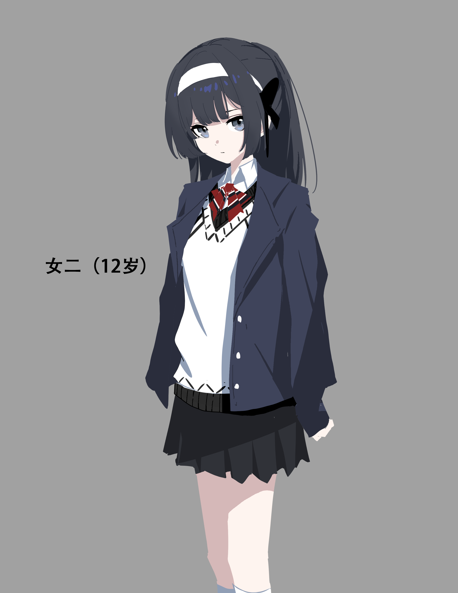

# 十四号城项目剧本

主线

第一部：《茧与降神》

**序章**

**《重生\|新生》**

作者：蓝

创建日期：2025.7.30

**梗概**

第一幕：

女二12岁时，就读于津渡一中

回忆：实验室仿生人失控事件（意识创伤）

父亲驱车来到仓库与黑神党残余分子交易

黑神党分子急于处理掉仿生人这个烫手山芋，同意了父亲的低价收购，父亲承诺会把仿生人送往城外的研究所，避开城内排查。

女二下车寻找父亲，一边躲避巡警一边前往仓库。巡警看到停放在路边的空车，引擎盖还有温度，于是开始向四周搜查。

女二来到仓库边，放哨的是父亲的同僚，对方认出自己，交流后，对方回到仓库报信。女二悄悄跟了进去。

装载仿生人的容器上有一枚醒目的白金色图案。容器的外壳精密光滑，很难相信是用一个恐怖组织的小作坊制造的。

仿生人失控暴走，父亲被砍伤，女二被留下意识创伤，黑神党分子当场死亡，女二晕倒前看到巡警赶来

女二住院。父亲被捕入狱。父亲的同僚乱中躲过一劫，把仿生人运到了城外。

失控的仿生人宕机后运往城外。

这件事在隔日被新闻报道：一男子疑与恐怖分子残党非法交易时爆发冲突。据当事嫌疑人口供，系恐怖分子持意识科技武器暴起袭击，自己为了保护女儿作正当防卫，夺刀后反击，致该名恐怖分子当场死亡。该嫌疑人已因非法走私罪和疑似购买、持有意识武器罪被捕。然而，现场并未发现嫌疑人提到的凶器，目前警方正在扩大搜查范围。

又隔一日：前日报道的恐怖分子交易冲突案中失落的凶器，已由警方找到，经核对确认是由恐怖组织黑神党生产的长刃状意识科技武器。

女二在住院时看到了新闻。播报里的那张“凶器”图片，分明不是那个暴起仿生人的武器。

因为超氧公司已经介入到案件调查中，通过贿赂和假凶器物证，要求警方停止调查，由超氧接手后续事宜。

受意识创伤的女二精神状态很差，津渡一中也不想跟这涉事的一家子有牵连，表示希望女二签署自愿转学协议书。母亲求情，希望校方收留女二。这时，一位名为昆山的教官通过消息找到了女二母女二人，表示可以接纳她进入一所意识特训学校。于是女二转学，后来也以优秀的成绩考入仿生技术相关学部——仿研一科。女二受到教官昆山教导。实际上昆山提供的不只是教育，还有对女二的保护——因为超氧公司一定会为了仿生科技追查到女二一家。

第二幕

女二16岁时

回忆：超氧绑架事件（女二父母失踪，被超氧绑架至废弃实验室，启动高危仿生人，逃离到同学疗养师家中）

父亲在监狱，母亲去监狱探监，然而这日二人意外遭到超氧绑架。超氧的目的是黑神党的遗产，也是父亲走私的

女二父亲实验室的遗留资产都已经转移到城外研究所，包括那个仿生人

女二被超氧武装小队挟持到实验室，女二趁机启动仿生人，自己趁乱逃走，再度暴走的仿生人杀死了其他所有人。

女二从城外一路逃回城内，避人耳目地来到同学疗养师家中避难

第三幕：

女二投靠仿研所（结识双子）

结识并成为琳的领航员（主视角转琳）

**人物**

琳：仿生人，黑神党遗留的科学遗产，产自至高联合。

女二：芊，序章主角。

双子：姐姐陈珏馨，妹妹陈珏希，两名仿生人。

女二父亲：科学家，有一所私人实验室。原本实验室受到超氧投资，但超氧上台后突然撤资，导致女二父亲与实验室失去经济来源，所以不得不走上非法走私倒卖仿生科技产品的路。

女二母亲：上层乐团的大提琴手

同僚：女二父亲的实验室的工作人员，25岁年轻男子，研究生。实验室破产后，留下的为数不多的人之一。

闫洇符：女二同班同学，外号音符，性格沉稳犀利，执着于胜负，成绩第一，缺乏同情心，但身边依然有很多人围着转。后应聘成为超氧的仿生人领航员。

疗养师：女二同校同学，性格软糯，温柔善良，心思细腻，

**场景**

郊区仓库：女二父亲的交易场所，走私品中转站

城外研究所：由废弃塔房改建的意识科技实验室，父亲原本打算将私人实验室迁移到此处，进行后续的科学活动与生产。

**第一幕（ACT.1）**

十四号穹顶城，市元27年，困兽时代。

由前戍卫军团组建的临时军政府，十四号城的明面最高政治集团，此刻在未知恐怖主义势力的围攻下已然只剩空壳。自27年峰会遭受袭击后，临时军政府与伴生机构安委会便一蹶不振，地方帮派的力量一度追平军警武装势力，而更令人无法忽视的是一家名为超氧的民营科技企业的野蛮生长。一时间，走私、暴力、恐怖袭击、示威、民间冲突，把十四号城搅成一锅粥，用来喂饱老鼠和蟑螂正合适。

市元28年

多害相权取其轻。面对恐怖组织、地方势力和垄断企业，军政府选择与超氧企业秘密会谈，将政治机构权力的关键部分转移到“一号”系统中，并将超氧公司委任为中央科技与政治的临时责任集团。此举相当于承认十四号城的政治被超氧架空，加上已成定势的经济垄断，超氧一手遮天的正法时代就此开启。

军政府放弃反抗，无声地宣告垮台。

而刚刚上台的超氧“不负众望”地点起三把火，以空前先进的意识科技储备和不明手段，大力整治了十四号城的混乱现状。速度之快，令人不免多疑——一切就像早有计划一般。

某日，疑似袭击峰会的恐怖组织黑神党领导人及其集团大部分成员的尸体被发现于涪西区城郊教堂以及地下墓室内，确认现场没有任何生命体征。教堂内的尸体衣冠较为完整，死亡时间雷同，由几种不同长度的锐器一击致死，未发现反抗痕迹。而地下室现场则混乱不堪，有大量激烈反抗痕迹，以及复数超武装个体打斗留下的痕迹，黑神党集团领导人的尸首在此处几乎不可辨认，警方正在对尸体逐一核实身份。

而故事则发生于当日夜晚。

黑神党覆灭的消息给动荡的局势添了把猛料，因此公路要道都设立了交警关卡。

**（SC01）**

十四号城涪西区北部，郊区公路，晚上八点

“您好，靠边停车，安全盘查”伸手拦住车的交警们打着手电筒围上来。

**交警A**

“去哪儿的？”

**男子**

（开车的男子从看得见的地方掏出驾照与身份证。）

“警官，我是接女儿放学的，她现在才上完晚自习”

（交警手电筒照到了副驾驶上孤僻的黑发小女孩，她不为所动，也只字不发。）

**交警B**

“啧啧，这么小年纪，学习压力倒不小。（瞥视一眼女孩的校服）津渡一中的吧？”

**男子**

（男子连连点头）

“对对。”

交警核对了证件和车牌。另外几个交警不经心地交谈着，四处打量。

交警A突然严肃地看向开车的男子。

**交警A**

“这位先生。”

**男子**

“警官，有什么问题吗？”

**交警A**

“您的女儿，”他绕到车右侧，看向副驾的女孩。

男子咽了下唾沫。

**交警A**

（拉开车门）

“未成年不能坐副驾驶。”

**男子**

“不好意思不好意思。小芊，你到后排去。”

女孩机械地解开安全带，走下车，坐到后座，像收到命令的木偶。

交警放走了这辆车。

“...”

**女孩**

“爸爸？我明明不是…”

**男子**

“爸爸待会要见几个…生意上的朋友，你等下不要走动，就待在车里”

黑发女孩只是沉默，一如既往。她习惯了父亲的谎言与算计，那背后埋藏着小孩子不可以知道的事情。她只是焦虑着，母亲的责问与爆发会何时到来，父母二人的矛盾何时会再一次倾泻到自己头上。

父亲向郊区开去，越来越偏远。

约十分钟后，车停在一只掉漆的黄色路牌旁，父亲关掉车灯，独自下了车。

于是，12岁的女孩不言，默默看着父亲独自走向路畔原野的黑夜里，天空中淡淡的夜辉与流动的虹光，衬出那远处隐约可见的、一座没有任何灯光的漆黑厂房。

二十分钟过去了。

不安，焦虑，怀疑，风吹草动，犬吠虫鸣。后视镜里出现了两三个光点，跳跃着，越来越大，女孩看到了车后不远处有举灯徘徊的巡警往这边走来。种种不好的念头涌上心间，她决定下车，摸黑向父亲走的方向寻去。

仓库没有开灯，一名与女儿父亲共事的年轻同僚站在门口把风放哨，在夜风里有些瑟瑟发抖。

女孩小心地穿梭在小路间，她回头，看到一名巡警已经找到了父亲的车，正招呼另外几名巡警过来，其中一人摸到了尚且温热的引擎盖。女孩低头，顾不上黑暗和崎岖，加速摸向那座仓库，校服被草枝划破出了许多线头。
